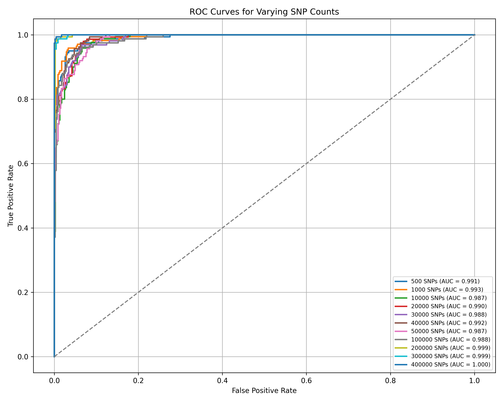

# Polygenic Risk Score Prediction Using Machine Learning 🧬

Tanzania Vernon

-This project uses machine learning to simulate and optimize Polygenic Risk Scores (PRS) using data from the 1000 Genomes Project.

## Table of Contents 
- [🧠 Abstract](#abstract)

- [🔬 Dataset](#dataset)

- [⚙️ Methodology](#methodology)

- [📊 Results](#results)

- [⚠️ Limitations](#limitations)

- [🚀 Future Direction](#future-direction)

- [Poster](#poster)

## Absract 🧠
Identifying individuals at elevated risk for disease is a central challenge in genomics. This project applies machine learning to predict disease risk by constructing polygenic risk scores (PRS) from real genetic data sourced from the 1000 Genomes Project. To simulate a polygenic trait, I extracted unique biallelic SNPs from chromosome 1 and assigned each SNP a simulated effect size (β) drawn from a normal distribution. 

Polygenic risk scores were calculated for each individual as the weighted sum of SNP dosages multiplied by these β values. Individuals in the top 25% of PRS were labeled as high risk, while the remaining 75% were labeled low risk. This binary classification served as the target variable for training a logistic regression model using SNP genotype data as features. 

The model successfully learned to distinguished high-risk individuals in a purely simulated context, demonstrating the feasibility of using realistic genomic structure to test PRS-based prediction pipelines. By working in a controlled environment with simulated outcomes, I created a flexible framework for experimenting with PS construction, modeling choices, and future extensions using real-world phenotypic labels. 

## Dataset 🔬
I used real genomic data from the 1000 Genomes Project, a landmark international collaboration that has cataloged human genetic vaiation across global populations. The full dataset includes whole-genome sequencing data from 2,504 individuals reprresenting 26 populations worldwide. 

For this project, we focused on Chromosome 1, extracting biallelic single nucleotide polymorphisms (SNPs) from the publicly available VCF (Variant Call Format) files. SNP dosage data was derived from individuals genotypes, representing the number of alternate alleles (0, 1, or 2) per variant site. 

The choromosome-scale SNP matrix served as the input for simulating disease risk through polygenic risk score (PRS) modleing. The use of real genomic architecture ensures realistic linkage disequilibrium patterns and allel frequency distribution while allowng full control over phenotype simulation. 

The dataset is available here: 
https://www.internationalgenome.org/data

## Methodology ⚙️

I developed a polygenic risk scoring pipeline using genomic data and a simulated disease model. I preproceesed the data, simulated risk, and train a predictive model by doing the following: 

1. SNP Extraction: 
   I extracted uniqu biallelic SNPs from the Chromosome 1 VCF file, representing high-quality, autosomal variants.

2. Effect Size Simulation: 
   To simulate a complex polygenic trait, I assigned each SNP a synthetic effect size (β value) randomly drawn from a     standard normal distribution. These values represent the simulated contribution of each SNP to disease risk.
   
3. PRS Calculation: 
   For each individual, I computed a polygenic risk scor as the sum of :

                       PRS_i = Σ (SNP_dosage_ij × β_j)

   where SNP dosage is the count of alternate alleles at position j for individual i.
   
4. Risk Label Assignment: 
   Individuals in the top 25% of PRS distriution were labeled High Risk (1); the remaining 75% were labeled Low Risk      (0). This binary label served as the supervised learning target.
   
6. Model Training: 
   I trained a logistic regression classifier to predict high-risk individuals using the SNP genotype matrix as input.    The model was evaluated using ROC curves across varying SNP set sizes to asses classification performance.

## Results 📊

The logistic regression model demonstrated strong classification performance in identifying individuaks with high simulated polygenic risk. ROC (Receiver Operating Characteristic) curves were generated for multiple SNP set sizes, and the model consistently achieved high AUC (Area Under the Curve) values. 

Each ROC curve visualized the balance between true positive rate (sensitivity) and false positive rate (1 - specificity) across decision thresholds. These results confirm the model's ability to recover embedded risk patterns from simulated PRS, even in a complex, multivariate genomic context. 

This suggests that PRS-based modeling frameworks, even with synthetic traits, can effectively capture signal from real-world genotypes structures and serve as a platform for testing predictive pipelines. 

## Limitations ⚠️

1. Lack of Real Phenotype Data: 
   This project uses simulated β values and artificially defined high-risk labels. While this allows controlled           experimentation, it does not reflect true biological effect sizes or clinically validated phenotypes. Real-world       results may differ when working with observed traits and known SNP association.
2. No Causal Inference: 
   The approach identifies statistical signals but does not infer causal relationships between ariants and disease.       Without biological validation or functional studies, the SNPs highlighted by the model should be considered            correlative, not deterministic
3. Population Structure Bias: 
   The 1000 Genomes Project includes individuals from diverse ancestries, but the risk label threshold (top 25%) was      applied uniformly, which may introduce bias or reduce model generalizability across populations. In real clinical      use, PRS thresholds and allele frequencies should be ancestry-specific
4. Interpretability of the Model: 
   While logistic regression is interpretable, the biological meaning of feature weights is limited due to the            simulated nature of the data. These models should not be used for vairant prioritazation or downstream functional      studies.
5. Overfitting Risks: 
   Without cross-validation across seperate genotype cohorts, the model may overfit the simulated labels, especially      if SNPs with extreme β values dominate the score. This could inflate performance metrics in a synthetic context.
6. Scalability to Whole-Genome Analysis: 
   This project focused only on Chromosome 1. Scaling to the full genome would significantly increase computational       complexity and storage requirements, and may introduce noise if weakly associated SNPs dlute the signal.          
   
## Future Direction 🚀

This project provides a foundation for simulating and modeling polygenic risk using real genomic structure. Fututre work can explore the following avenues: 

- Use of real GWAS summary statistics to replace β values and enable trait-specific PRS modeling.
- Incorporation of clinical phenotypes to validate model predictions against true disease outcomes.
- Testing across full genome data, beyond Chromosome 1, to assess genome wide predictive accuracy and computational scalability.
- Model generalization across populations, addressing ancestry-specific performance gaps by stratifying or reweighting based on population structure.
- Integration of deel learning models to capture complex non-linear effects and interactions
- Functional annotation of high-weight SNPs to identify potential regulatory or coding regions influencing trait variation. 
